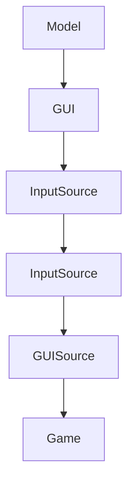

## Main.java

```import ucb.util.CommandArgs;```伯克利自定义包 将命令行解释为主程序

```import java.util.Random;``` 随机类



## Task1:public static boolean emptySpaceExists(Board b)

> 检测是否存在空余区间 如果存在返回true

1. 不能调用变量，因为都是私有，直接调用函数
2. 不能调用新的函数完成这个任务
3. 理解整个代码需要时间，但是完成任务很简单

## Task2:public static boolean maxTileExists(Board b)

> 检测其中是否存在最大tile 存在返回true

1. 弄懂怎么获取tile中的值
2. tile如果为空怎么处理

## Task3:public static boolean atLeastOneMoveExists(Board b)

我的答案：

```java
    public static boolean atLeastOneMoveExists(Board b) {
        for(int i = 0;i < b.size();i++){
            for (int j = 0; j < b.size(); j++) {
                if(b.tile(i,j) == null) continue;
                if(i+1 < b.size() && b.tile(i,j).value() == b.tile(i+1,j).value()){return true;}
                else if(i-1 > 0 && b.tile(i,j).value() == b.tile(i-1,j).value()){return true;}
                else if(j+1 < b.size() && b.tile(i,j).value() == b.tile(i,j+1).value()){return true;}
                else if(j-1 > 0 && b.tile(i,j).value() == b.tile(i,j-1).value()){return true;}
            }
        }
        return false;
    }

```

1. 如果旁边的为空怎么考虑？
2. 旁边的为空 如果考虑下一个方向？

大佬答案：

```java
public static boolean atLeastOneMoveExists(Board b) {
    if (emptySpaceExists(b)) {
        return true;
    }
    // 4 directions, LEFT/UP/RIGHT/DOWN
    int[] dx = {0, -1, 0, 1};
    int[] dy = {-1, 0, 1, 0};
 
    int size = b.size();
    for (int col = 0; col < size; col++) {
        for (int row = 0; row < size; row++) {
            // Because we have checked emptySpace, t.values() must exist
            int curTileValue = b.tile(col, row).value();
            for (int move = 0; move < 4; move++) {
                int colNew = col + dx[move];
                int rowNew = row + dy[move];
                // make sure the tile is within the boundary
                if (colNew > 0 && colNew < size && rowNew > 0 && rowNew < size) {
                    Tile newTile = b.tile(colNew, rowNew);
                    if (newTile.value() == curTileValue) {
                        return true;
                    }
                }
            }
        }
    }
    return false;
}
```

1. 四个方向上的搜索怎么处理更加方便
2. <font color='red'>将四个方向单独考虑 抽离出来--学习</font>